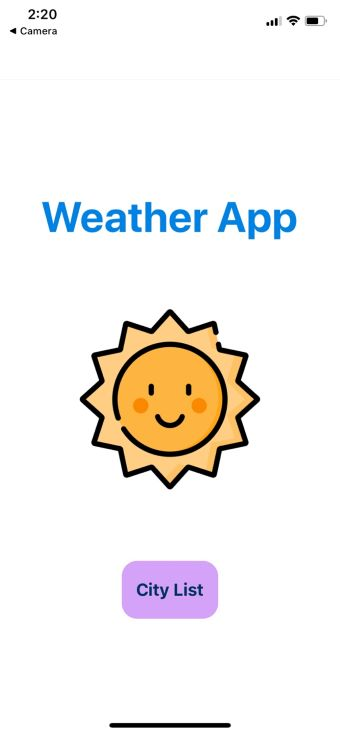
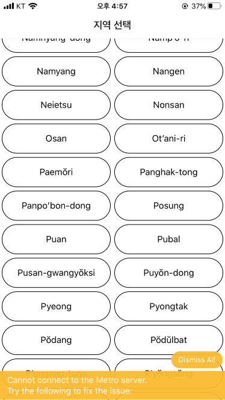
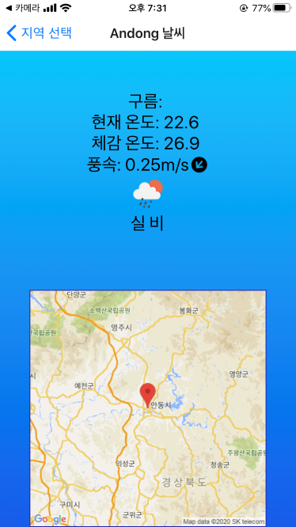
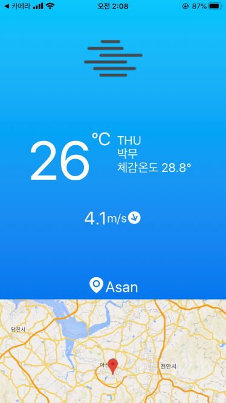

# Weather App

## How to run
### install whole dependencies
```bash
$ npm install
```

### node_modules\expo\AppEntry.js 내용 수정
    import App from '../../App';
    -> import App from '../../src/App';

### Execute
```bash
$ expo start
```

## 구현사항
### 1. 시작 페이지 추가
* startPage 추가
    * TouchableOpacity 컴포넌트를 사용하여 터치 이벤트를 사용할 수 있는 뷰를 만들었다.
        ```js
        <TouchableOpacity
            style={styles.button}
            onPress={() => this.onPressCity()}>
            <Text style={styles.text}>City List</Text>
        </TouchableOpacity>
        ```
    * 시각적인 이미지를 추가하여 사용자가 보다 이해하기 쉽게 구현하였다.
        ```js
            <Image style={styles.image} source={require('./weather.png')}/>
        ```
    * 스타일 속성을 사용하여 보다 사용자가 보기 좋게 구현하였다.(사진 크기, text 크기 및 색상 등)



### 2. CityList 버튼 경계선 추가
* 스타일 속성을 추가하여 클릭해야 할 버튼들의 경계를 명확히 하였다.
    ```js
    item: {
        flex: 1,
        height: 50,
        justifyContent: 'center',
        borderWidth: 1,
        borderRadius: 30,
        margin: 3,
      }
    ```


### 3. 체감 온도 항목 추가 및 배경색 변경
* 체감온도 항목 추가
    ```js
    renderFeelsLike() {
        const feelsLike = this.state.main.feels_like - 273.15;
    
        return (
          <Text style = {styles.text_day}>
            체감 온도: {feelsLike.toFixed(1)}
          </Text>
        );
      }
    ```
* 배경 그라데이션 추가
  ```js
  <LinearGradient
            colors={["#00C6FB", "#005BEA"]}
            style = {styles.container}
         >
  ```


### 4. 표시 정보 추가 및 배치 변경
* 요일 정보 표시
    ```js
    renderFeelsLike() {
        const feelsLike = this.state.main.feels_like - 273.15;
    
        return (
          <Text style = {styles.text_day}>
            체감 온도: {feelsLike.toFixed(1)}
          </Text>
        );
      }
    ```
* 각 정보 출력 배치 변경
    ```js
    <View style={styles.conditionContainer}>
          {this.renderWeatherCondition()}
        </View>
        <View style = {styles.container_mid}>
          <View>
            {this.renderTemperature()}
          </View>
          <View style = {styles.container_today}>
              <View>
                {this.renderDay()}
                {this.renderWeather()}
                {this.renderFeelsLike()}
              </View>
            </View>
        </View>
        <View style={styles.container_wind}>
          {this.renderWind()}
        </View>
        <View style={styles.container_location}>
          {this.renderLocation()}
        </View>
        <View style={styles.mapContainer}>
          {this.renderGoogleMap()}
        </View>
    ```

